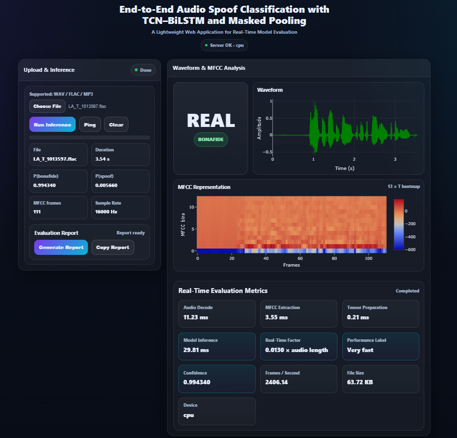

# End-to-End Audio Spoof Classification Web App

A lightweight FastAPI web application for real/fake audio spoof classification using MFCC features, a TCN-BiLSTM temporal encoder, and masked mean pooling.

## Application Screenshot




## Project Structure

```text
audio-spoof-classification/
├── app.py
├── requirements.txt
├── README.md
├── .gitignore
├── models/
│   └── best_AN_asvspoof2019_LA_fullclip_byEER.pth
├── samples/
│   ├── real/
│   │   └── put real/bonafide audio samples here
│   └── fake/
│       └── put fake/spoof audio samples here
└── templates/
    └── index.html
```

## App Description

This app allows users to upload an audio file and classify it as **REAL / bonafide** or **FAKE / spoof**. It displays the prediction confidence, waveform, MFCC representation, and real-time inference metrics through a web interface.

## Setup

### 1. Create a virtual environment

```bash
python -m venv venv
```

Activate it:

```bash
# Windows
venv\Scripts\activate

# macOS / Linux
source venv/bin/activate
```

### 2. Install dependencies

```bash
pip install -r requirements.txt
```

### 3. Check model checkpoint

The default checkpoint path is:

```text
models/best_AN_asvspoof2019_LA_fullclip_byEER.pth
```

You can also use a different checkpoint by setting `CKPT_PATH`:

```bash
# Windows PowerShell
$env:CKPT_PATH="C:\path\to\your_model.pth"

# macOS / Linux
export CKPT_PATH="/path/to/your_model.pth"
```

### 4. Run the app

```bash
python app.py
```

Open this URL in your browser:

```text
http://127.0.0.1:8000
```

## Sample Audio Folder

Place your example audio files like this:

```text
samples/real/real_001.wav
samples/real/real_002.wav
samples/fake/fake_001.wav
samples/fake/fake_002.wav
```

Supported upload formats in the web page are WAV, FLAC, MP3, and common audio formats.

## Create Git Repository

```bash
git init
git add .
git commit -m "Initial commit: audio spoof classification web app"
```

## Push to GitHub

Create an empty GitHub repository first, then run:

```bash
git branch -M main
git remote add origin https://github.com/YOUR_USERNAME/YOUR_REPO_NAME.git
git push -u origin main
```

## Notes

- Keep the model checkpoint inside `models/` if it is small enough for GitHub.
- GitHub blocks files larger than 100 MB. For larger checkpoints, use Git LFS or upload the model separately.
- Keep only short demo audio files inside `samples/` if the dataset is large.
